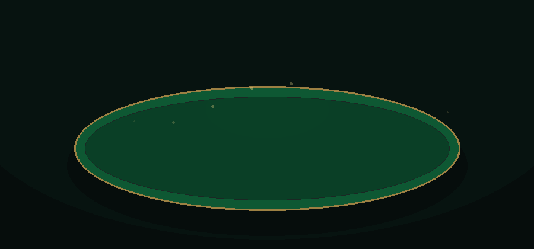

# Tarot français en ligne

Application TypeScript jouable pour le Tarot français à 2, 3, 4 ou 5 joueurs, avec lobby Socket.IO, validation serveur, cartes SVG locales, plis, chien, appel du Roi et comptage automatique.

<p align="center">
  
</p>

## Site en ligne

Le jeu est déployé sur Render et accessible ici :

https://tarot-francais.onrender.com/

### Tester le site

Pour tester une partie :

1. Ouvrir le site.
2. Choisir un pseudo.
3. Créer une partie.
4. Choisir le mode : 2, 3, 4 ou 5 joueurs.
5. Partager le code du salon avec les autres joueurs.
6. Les autres joueurs rejoignent avec le code.
7. Lancer la partie quand le salon est complet.

### Modes disponibles en ligne

- Mode 2 joueurs : variante avec 15 cartes en main et 6 tas visibles progressivement.
- Mode 3 joueurs : Tarot classique avec chien de 6 cartes.
- Mode 4 joueurs : Tarot classique avec chien de 6 cartes.
- Mode 5 joueurs : Tarot avec appel du Roi et chien de 3 cartes.

## Règles implémentées

- Parties à 2, 3, 4 et 5 joueurs.
- Lobby avec pseudo, création, code court, join, nombre de joueurs et démarrage bloqué tant que le salon n'est pas plein.
- Déconnexion avant partie : le joueur est retiré du salon.
- Déconnexion pendant une manche : la manche est bloquée et l'interface l'affiche.
- Deck complet : 56 cartes de couleur, 21 atouts, Excuse.
- Distribution serveur : 24 cartes + chien de 6 à 3, 18 cartes + chien de 6 à 4, 15 cartes + chien de 3 à 5.
- Enchères : Passe, Petite, Garde, Garde sans, Garde contre.
- Passe générale : manche annulée, nouvelle donne disponible.
- Chien : révélé et écarté pour Petite/Garde, caché pour Garde sans/Garde contre.
- Jeu des plis : fournir la couleur, couper, monter à l'atout si possible, Excuse simplifiée.
- Appel du Roi à 5 joueurs avec partenaire secret et révélation quand la carte appelée est jouée.
- Interdiction d'entamer la couleur appelée tant que la carte appelée n'a pas été jouée, sauf avec la carte appelée elle-même.
- Comptage des points, seuils selon les bouts, multiplicateurs et scores à somme nulle.
- Historique des manches terminées.
- Machine d'état : `dealing`, `bidding`, `king_call`, `dog_reveal`, `discard`, `playing`, `trick_resolution`, `round_scoring`, `round_finished`.

## Règles simplifiées

- Les enchères sont faites en un seul tour de table. Un joueur ne revient pas parler après une surenchère ultérieure.
- La distribution respecte les quantités officielles, mais ne simule pas la distribution paquet par paquet.
- L'Excuse ne gagne jamais le pli, reste au camp du joueur qui l'a jouée et vaut comme bout. Les cas particuliers de dernier pli et d'échange de carte ne sont pas modélisés.
- Le Petit au bout, les poignées et le chelem ne sont pas encore comptés.
- Les Rois et les bouts sont interdits à l'écart. Les atouts non-bouts ne sont autorisés à l'écart que si le preneur n'a pas assez de cartes de couleur non-Roi pour faire l'écart.
- La carte appelée ne peut pas être écartée.
- Il n'y a pas de jeton de reconnexion. Une déconnexion pendant la manche bloque proprement la partie.

## Mode 2 joueurs — variante 15 cartes + 6 tas

Cette variante n'est pas la règle officielle principale du Tarot. Elle est différente du mort, de la tirette, de la découverte avec chien, d'une variante à 24 cartes en main et d'une variante avec troisième main virtuelle.

Distribution :

- chaque joueur reçoit 15 cartes en main
- chaque joueur reçoit 6 tas de 4 cartes
- seule la carte du dessus de chaque tas est visible
- il n'y a pas de chien
- il n'y a pas d'enchères, de preneur, d'écart ou d'appel du Roi

Jeu :

- la manche commence directement en phase `playing`
- à son tour, un joueur joue une carte de sa main ou la carte visible d'un de ses tas
- quand une carte visible d'un tas est jouée, la suivante devient visible
- les cartes cachées sous les tas ne comptent pas pour l'obligation de fournir ou de couper
- les cartes cachées des tas adverses restent côté serveur et ne sont jamais envoyées au client

Score :

- chaque joueur marque les points des cartes gagnées dans ses plis
- le total du jeu reste 91 points
- le joueur avec le plus de points gagne la manche
- le score de manche est l'écart de points : gagnant `+écart`, perdant `-écart`
- le total des scores est toujours nul

## Mode 3 joueurs

Chaque joueur reçoit 24 cartes, le chien contient 6 cartes. Le meilleur enchérisseur devient preneur. Pour Petite et Garde, le chien est révélé, ajouté à sa main puis il écarte 6 cartes. Pour Garde sans, le chien compte pour le preneur sans être vu. Pour Garde contre, il compte pour la défense.

Score :

- preneur gagnant : `+2 × score`, chaque défenseur `-1 × score`
- preneur chuté : `-2 × score`, chaque défenseur `+1 × score`

## Mode 4 joueurs

Chaque joueur reçoit 18 cartes, le chien contient 6 cartes. Le meilleur enchérisseur devient preneur. Pour Petite et Garde, le chien est révélé, ajouté à sa main puis il écarte 6 cartes. Pour Garde sans, le chien compte pour le preneur sans être vu. Pour Garde contre, il compte pour la défense.

Score :

- preneur gagnant : `+3 × score`, chaque défenseur `-1 × score`
- preneur chuté : `-3 × score`, chaque défenseur `+1 × score`

## Mode 5 joueurs

Chaque joueur reçoit 15 cartes, le chien contient 3 cartes. Après les enchères, le preneur appelle une carte avant révélation du chien.

Rangs appelables :

- Roi par défaut
- Dame si le preneur possède les 4 Rois
- Cavalier s'il possède les 4 Rois et les 4 Dames
- Valet s'il possède aussi les 4 Cavaliers

Le propriétaire de la carte appelée devient partenaire secret. Si la carte est au chien ou dans la main du preneur, le preneur joue seul contre quatre défenseurs.

Score avec partenaire :

- camp preneur gagnant : preneur `+2 × score`, partenaire `+1 × score`, défenseurs `-1 × score`
- camp preneur chuté : preneur `-2 × score`, partenaire `-1 × score`, défenseurs `+1 × score`

Score en solo :

- preneur gagnant : `+4 × score`, défenseurs `-1 × score`
- preneur chuté : `-4 × score`, défenseurs `+1 × score`


  ### Limites de la version gratuite Render

Le site utilise l’hébergement gratuit Render.

Conséquences possibles :

- le premier chargement peut être lent si le site était inactif ;
- les salons sont stockés en mémoire côté serveur ;
- si le serveur redémarre ou se met en veille, les salons en cours peuvent disparaître ;
- cette version est adaptée pour jouer entre amis, mais pas encore pour une utilisation publique intensive.

### Données et sauvegarde

Cette version ne possède pas encore de base de données.

- Les comptes utilisateurs ne sont pas sauvegardés.
- Les parties en cours ne sont pas persistées après redémarrage du serveur.
- L’historique des scores n’est gardé que pendant la session serveur active.
## Installation

```bash
npm install
```

Les SVG des cartes sont versionnés dans `client/public/cards`. Vite les copie dans `client/dist/cards` pendant le build, puis Express les sert sur `/cards/...` avec le reste de l'application.

## Développement

```bash
npm run dev
```

Par défaut :

- client Vite : `http://localhost:5173`
- serveur Express/Socket.IO : `http://localhost:3001`

## Build

```bash
npm run build
npm start
```

Après build, le serveur de production sert `client/dist`, les SVG dans `client/dist/cards`, l'API Express et Socket.IO sur le même domaine.

## Tests

```bash
npm run test
```

Les tests unitaires couvrent :

- création du deck de 78 cartes
- mapping carte vers SVG embarqué dans `client/public/cards`
- distributions 2, 3, 4 et 5 joueurs
- enchères et surenchère
- appel à 5, partenaire, carte au chien, self-call
- écart du chien
- Excuse jouée par le preneur ou la défense
- variante 2 joueurs avec 15 cartes en main et 6 tas visibles progressivement
- chien caché/révélé et sécurité de l'état public
- machine d'état et transitions de manche
- validation de coups légaux et illégaux
- gagnant d'un pli
- points, seuils et scores finaux à 2, 3, 4 et 5 joueurs

## Structure

```text
client/               React + Vite, affichage de l'état public et envoi des actions
client/public/cards/  SVG des cartes inclus dans le build Vite
server/               Express + Socket.IO, salons, états privés, validation de toutes les actions
shared/               Types et moteur métier Tarot testable
```

La logique de règles n'est pas dans React. Le client reçoit uniquement sa main, les informations publiques, les cartes jouées, les scores et le nombre de cartes adverses. La fonction `getPublicGameStateForPlayer` construit cette vue joueur par joueur.

